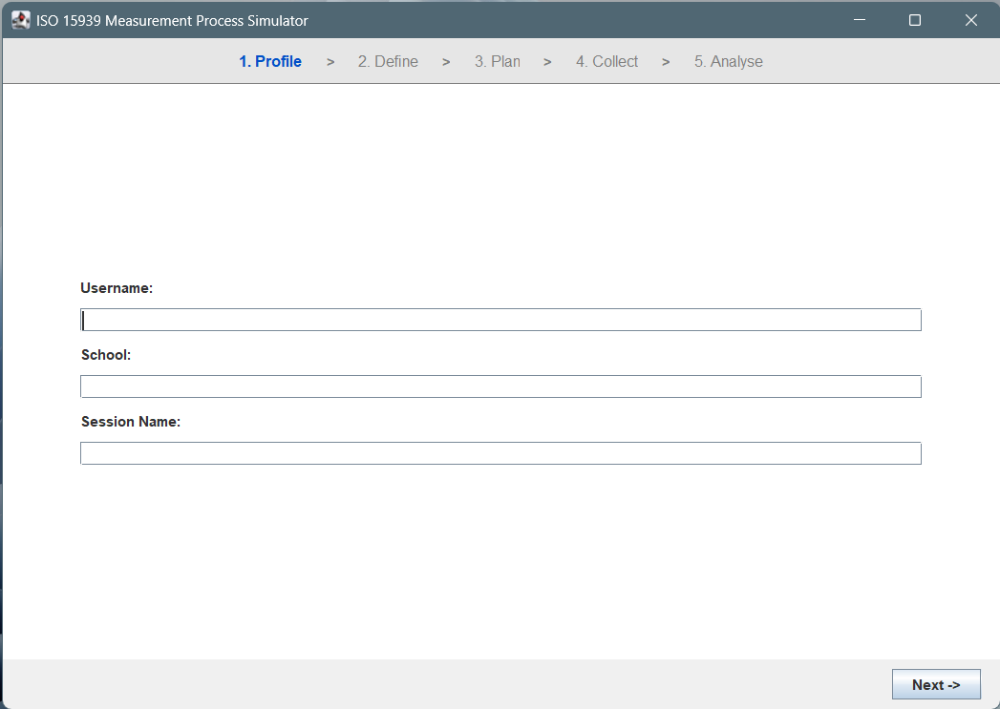
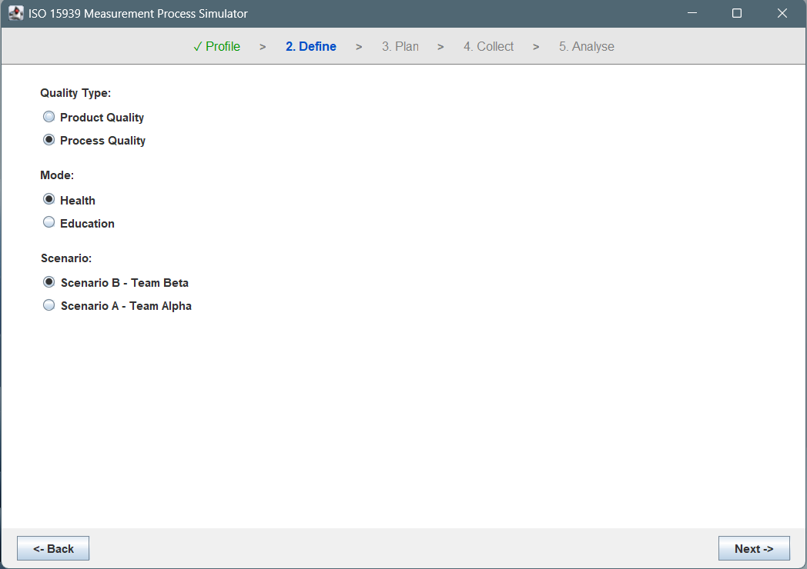
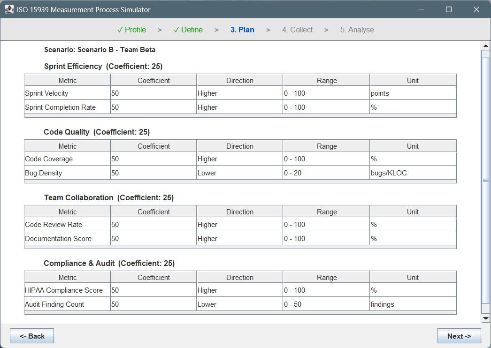
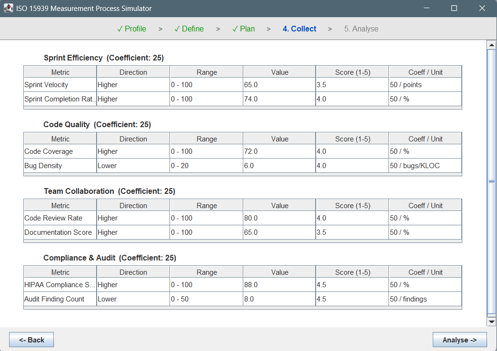
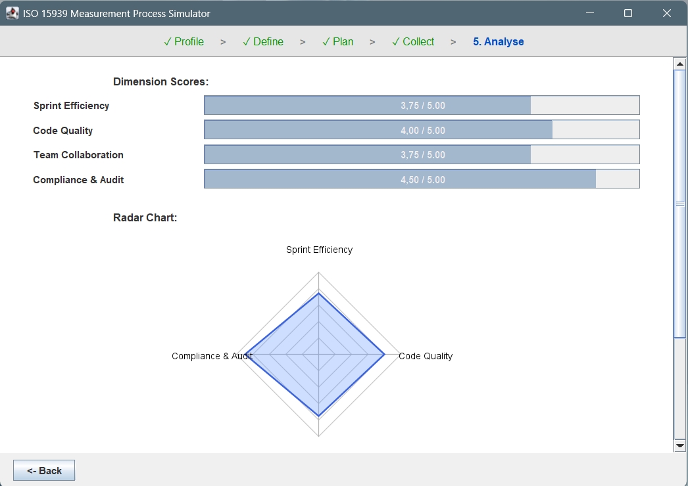
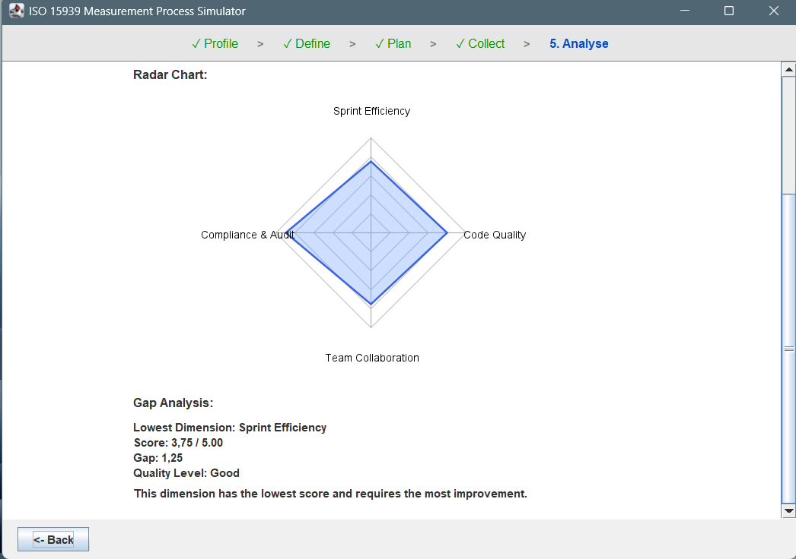

# ISO 15939 Measurement Process Simulator

A Java Swing desktop application that simulates the 5-step ISO/IEC 15939 software measurement process.

---

## Student Info

**Name:** Elifnaz AKKAYNAK  
**Student ID:** 202328002  
**Course:** Software Project II (SENG272)

---

## How to Compile & Run

Java 17 or higher required. All `.java` files must be in the same folder.

```bash
# Compile
javac *.java

# Run
java Main
```

---

## Application Steps

**Step 1 – Profile**  
Enter username, school, and session name.



**Step 2 – Define**  
Select quality type (Product / Process), mode (Health / Education), and a scenario.



**Step 3 – Plan**  
View the dimensions and metrics of the selected scenario. This step is read-only.



**Step 4 – Collect**  
Raw data values are displayed for each metric. Scores between 1–5 are calculated automatically.



**Step 5 – Analyse**  
See dimension scores as progress bars, a radar chart of all dimensions, and a gap analysis showing the weakest dimension.



---

## Project Structure

```
├── Main.java                  # Entry point
├── MainFrame.java             # Main window, wizard navigation
├── StepPanel.java             # Abstract base class for all steps
├── ProfilePanel.java          # Step 1
├── DefinePanel.java           # Step 2
├── PlanPanel.java             # Step 3
├── CollectPanel.java          # Step 4
├── AnalysePanel.java          # Step 5
│
├── User.java                  # User model
├── Scenario.java              # Scenario model
├── Dimension.java             # Dimension model
├── Metric.java                # Metric model
├── Analyzer.java              # Score calculation logic
├── ScenarioRepository.java    # Hard-coded scenario data
│
├── Direction.java             # Enum: HIGHER / LOWER
├── Mode.java                  # Enum: HEALTH / EDUCATION / CUSTOM
└── QualityType.java           # Enum: Product / Process
```

---

## Score Calculation

```
Higher is better:  score = 1 + (value - min) / (max - min) × 4
Lower is better:   score = 5 - (value - min) / (max - min) × 4
```

Result is rounded to the nearest **0.5** and clamped between **1.0** and **5.0**.

---

## Notes

- No external libraries used — standard Java SE only.
- All scenario data is hard-coded in `ScenarioRepository.java`.
- 4 scenarios available: 2 for Health mode, 2 for Education mode.
